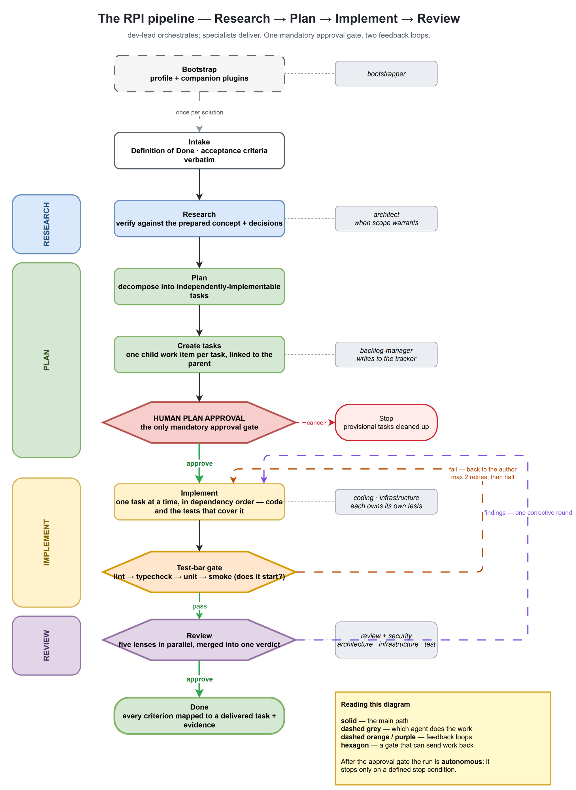

# Agile Agents

The **Agentic Agile Harness** — packaged as installable GitHub Copilot CLI plugins.
It takes a prepared requirement and drives it to a reviewed change without a human
between stages: an **RPI pipeline** — **R**esearch → **P**lan → **I**mplement → **R**eview —
over 15 specialist agents (1 supervisor + 4 authors + 7 reviewers, plus a backlog-manager, a bootstrapper and a capability-scout) plus
60 skills, with up-front concept + decision-record conformance, multi-lens review, and an eval/cost layer.

**Start here:** install `agile-agents-core`, then run **`bootstrapper`** — it profiles your repo,
writes the operational contract every agent reads, and installs the companion plugins your stack
needs. [Install →](#install)

## Install

```shell
copilot plugin marketplace add hoffe86/agile-agents
copilot plugin install agile-agents-core@agile-agents-marketplace
```

### Then run the bootstrapper — this is the first step

```shell
copilot --agent agile-agents-core:bootstrapper
```

…then tell it to set up the harness for the repo. (In an interactive session, selecting the
`bootstrapper` agent and asking it to "set up the harness for this repo" does the same thing.)

`bootstrapper` is the agent that configures the harness for your solution, and running it is how
you start. It:

1. **Reads your repo first**, then interviews you only for what no scan can tell it — lifecycle
   stage, test discipline, compliance scope, where documentation actually lives.
2. **Writes `.github/solution-profile.yaml`**, the operational contract every other agent reads.
3. **Works out which companion plugins your declared stack needs** and installs them — after
   showing you the list and asking. It never installs without an explicit yes.
4. **Tells you what is still missing** — empty required fields, and any technology you declared
   that no companion covers, so repo-convention fallback is something you expect rather than
   discover mid-run.

Everything downstream depends on that profile: which skills load, which gates fire, which tracker
gets written to, what the cost envelope allows. `dev-lead` blocks at Stage 0 until its six
required fields are populated, so bootstrapping first saves a stopped run later.

Re-run it any time to repair or update the profile — it handles both.

### Installing companions yourself

`bootstrapper` derives these from your profile, so you rarely need to. To do it by hand:

```shell
copilot plugin install agile-agents-dotnet@agile-agents-marketplace     # C# / .NET
copilot plugin install agile-agents-python@agile-agents-marketplace     # Python
copilot plugin install agile-agents-bicep@agile-agents-marketplace      # Bicep IaC
copilot plugin install agile-agents-terraform@agile-agents-marketplace  # Terraform IaC
copilot plugin install agile-agents-azure@agile-agents-marketplace      # Azure platform grounding
copilot plugin install agile-agents-ado@agile-agents-marketplace        # Azure DevOps Boards
copilot plugin install agile-agents-github@agile-agents-marketplace     # GitHub Issues
```

Agents route on **skill availability**, not on a hardcoded stack — an uninstalled companion
degrades to repo conventions rather than failing. To see what your installed set covers and what
it doesn't, ask **`capability-scout`** (`copilot --agent agile-agents-core:capability-scout`).

The `agile-agents-core` plugin ships `agents/` and the technology-neutral `skills/`.

## What you get

**15 agents** (`plugins/agile-agents-core/agents/`) — 1 supervisor + 4 authors + 7 reviewers + backlog-manager + bootstrapper + capability-scout:

| Role | Agent | Purpose |
|------|-------|---------|
| Supervisor | `dev-lead` | Orchestrates the RPI pipeline (Research → Plan → Implement → Review) across architect, backlog-manager, coding, infrastructure and review with gates |
| Author | `architect` | Read-only/advisory: serves the Research phase — verifies the change fits the prepared concept (in the framework declared by `documentation.framework`) + any accepted decision records, cites them, reports decision gaps; never authors ADRs |
| Author | `coding` | Implements features/fixes **and covers them with tests** (C# / Python; xUnit/NUnit/MSTest/TUnit, pytest) — one engineer's job, one hand-off |
| Author | `infrastructure` | Bicep, Terraform, Helm/Kustomize, CI/CD pipelines — and their IaC tests |
| Author | `data-scientist` | Analysis, experiments, models and their evaluation — two rubrics (classical ML and AI/LLM). Owns the model and its evidence; `coding` owns the app that serves it |
| Backlog | `backlog-manager` | Creates / improves / reviews tracker work items (ADO, GitHub, Jira, Linear); in the Plan phase materialises `dev-lead`'s task breakdown as child work items linked to the parent story |
| Bootstrap | `bootstrapper` | One-off bootstrap and repair: runs the profile interview, writes `solution-profile.yaml`, derives the companion plugins the declared stack needs and installs them with the user's approval, then reports what is still missing |
| Coverage | `capability-scout` | Dependency manager for harness artifacts: derives what each phase needs for the declared stack, reports the gaps, and proposes what would fill them and where it belongs. Read-only — proposes, never adopts |
| Reviewer | `review-lead` | Read-only orchestrator: triages which lenses the diff warrants, dispatches them in parallel, merges into one ranked report with one verdict. Performs no lens itself |
| Reviewer | `code-reviewer` | General code quality — correctness, line-level design, readability, standards, regressions, cloud-native anti-patterns, docs currency |
| Reviewer | `security-reviewer` | OWASP, CWE, NIST SSDF, MS SDL, MCSB, OWASP LLM Top 10 |
| Reviewer | `architecture-reviewer` | arc42, C4, WAF, AAC, microservices.io, DDD, ISO 25010 |
| Reviewer | `infrastructure-reviewer` | WAF, AVM, CAF, CIS Azure, OIDC, SLSA |
| Reviewer | `test-reviewer` | xUnit Test Patterns, Google Testing, Fowler test pyramid |
| Reviewer | `data-reviewer` | Statistical validity — leakage, baselines, metric choice, uncertainty, cohort fairness, reproducibility, dataset provenance |

**Repo-scope skills** (`plugins/agile-agents-core/skills/`) — hand-written plus a set vendored from
[github/awesome-copilot](https://github.com/github/awesome-copilot/tree/main/skills)
(intermixed flat). Includes `read-repo-context` — the foundation skill every agent loads first
— and `reviewer-read-only-rules`, the defence-in-depth contract every review agent loads. See
[`plugins/VENDORED.md`](plugins/VENDORED.md) for the vendored index across all plugins.

**Companion skills** across seven technology plugins — install only what your project uses:

| Plugin | Skills |
|---|---|
| `agile-agents-dotnet` | `csharp-implementation`, `csharp-testing`, `aspire`, `ef-core`, `dotnet-design-pattern-review` |
| `agile-agents-python` | `python-implementation`, `python-testing`, `pytest-coverage`, `ruff-recursive-fix` |
| `agile-agents-bicep` | `bicep-implementation`, `update-avm-modules-in-bicep` |
| `agile-agents-terraform` | `terraform-azure-implementation`, `terraform-azurerm-set-diff-analyzer`, `import-infrastructure-as-code` |
| `agile-agents-azure` | `azure-platform-grounding` |
| `agile-agents-ado` | `ado-work-items` |
| `agile-agents-github` | `github-issues` |

**Tracker MCP servers are named by you, not by this harness.** Tool grants are
agent-scoped — a skill cannot grant them — so `backlog-manager` ships grants for the
common server names (`github`, `ado`, `azure-devops`, …). If yours is registered under a
different name, add `'<your-server>/*'` to the `tools:` list in
`plugins/agile-agents-core/agents/backlog-manager.agent.md`. A server that isn't granted
is unreachable even while it's running; `backlog-manager` preflights for this and tells
you which of the two causes it hit.

**`agile-agents-azure` is grounding, not automation.** It carries the Azure substitutions core
deliberately does not know — CAF naming and tagging, AVM selection and pinning, secure-by-default
resource settings, the Well-Architected pillars as concrete review checks, and the MCSB / CIS Azure
control ids reviewers cite. All of it applies to a *diff or a design*, before anything is deployed,
which is what an agent reviewing a pull request actually needs.

For **live-subscription** work — scanning deployed resources, querying real spend, provisioning,
diagnostics — install Microsoft's own
[`microsoft/azure-skills`](https://github.com/microsoft/azure-skills) alongside it. It ships ~28
operational Azure skills plus the Azure MCP Server (200+ tools, 40+ services), maintained by the
team that owns the platform. This harness does not duplicate any of it:

```console
copilot plugin marketplace add microsoft/azure-skills
copilot plugin install azure@azure-skills
```

Without either plugin, the Azure lens degrades to the neutral cloud lens plus whatever
`microsoft-docs` returns — correct, but with no conventions to enforce and no live subscription
context.

Three of those core skills — `trade-off-reporting`, `code-review` and `cloud-native-patterns` —
apply to every task rather than a phase: `trade-off-reporting` is named explicitly by the agents,
the other two load on demand when the task matches. They previously sat in a separate
`user/skills/` folder; they are now in `skills/` with everything else.

### MCP servers

Plugins ship their own MCP servers; every agent declares them, so an uninstalled companion
just means the tool isn't there.

| Server | Shipped by | Why |
|---|---|---|
| `context7` | `agile-agents-core` | Current, version-correct docs for whatever library the task touches — the cheapest defence against hallucinated APIs. |
| `microsoft-docs` | `agile-agents-core` | Microsoft Learn search / fetch / code samples. In core because the agents live in core and declare it; it also covers Azure, Bicep and ADO, not just .NET. |
| `playwright` | `agile-agents-core` | Interactive browser driving for `webapp-testing` — accessibility tree, console errors, failed requests, screenshots — and, for every other agent, rendering documentation that `web` alone can't fetch. Declared by all 15 agents. Runs `--headless --isolated` (fresh profile per session, no state leaking between runs); note that `--isolated` bounds profile persistence only, not what a page or script can reach. |
| `azure-mcp` | *(user-installed — Microsoft's own [`azure-skills`](https://github.com/microsoft/azure-skills) plugin)* | Live Azure resource context: 200+ tools across 40+ services — resource inventory, Log Analytics / App Insights queries, quotas, pricing, deployment status. Declared by `architect`, `infrastructure` and `infrastructure-reviewer`; the other agents review a diff and never query a subscription. Granted under three server-name aliases (`azure-mcp`, `azure-mcp-server`, `azure`) because the name varies by install method — unmatched grants are inert, so listing all three costs nothing and avoids a silent mismatch. |
| `microsoft/azure-devops-mcp` | *(user-installed)* | Work-item CRUD; used only by `backlog-manager`. |

### Tool access

Every agent gets the read/navigate set (`vscode, execute, read, search, web, todo`) plus the
MCP servers above. On top of that:

| Extra | Agents |
|---|---|
| `edit` | `architect`, `coding`, `data-scientist`, `infrastructure`, `backlog-manager`, `bootstrapper` |
| `agent` (delegation) | `architect`, `coding`, `infrastructure`, `backlog-manager` + `dev-lead`, `review-lead` |
| `browser` + `playwright/*` | all 15 — `coding` for E2E and browser-driven diagnosis, `backlog-manager` for the tracker web UI, everyone else to verify facts against rendered documentation |

**Reviewers never get `edit`.** That's the defence-in-depth half of
`reviewer-read-only-rules` — the contract is enforced in the prompt *and* by tool grant.
`capability-scout` doesn't get it either: it proposes adoptions, and a human makes them.

Reviewers **do** get the browser, because verifying a claimed API contract beats assuming it,
and a grant can't be split into "navigate but don't click". That half of the boundary is
therefore prompt-enforced: `reviewer-read-only-rules` treats navigating and reading as reads,
and refuses form submits, destructive clicks, console authentication, and
`browser_run_code_unsafe` / `browser_evaluate` outright — the contract is about **effects, not
file types**, so a click that deletes a cloud resource is a write however it was issued.

## How it works — the RPI pipeline

`dev-lead` is the supervisor. It drives a single, already-prepared user story through four
phases — **R**esearch → **P**lan → **I**mplement → **R**eview — delegating each phase to
specialist agents, gating their output, and reporting one Definition-of-Done verdict. The
concept (arc42, C4, or whatever `documentation.framework` declares) and any accepted decision
records are authored **up-front by humans**; the pipeline conforms to them and never writes
them — a missing decision is escalated, not invented. Projects without ADRs are supported.

<p align="center">
  
</p>

<sub>Editable source: [`docs/assets/rpi-pipeline.drawio`](docs/assets/rpi-pipeline.drawio) — open with draw.io / diagrams.net and re-export after changing it.</sub>

The two loops are the parts a straight line hides: the test bar returns to the author on failure
(twice at most, then the run halts), and review gets exactly **one** corrective round before it
stops and asks a human.

| Phase | What happens | Agents | Hand-off block |
|---|---|---|---|
| **Bootstrap** *(once, before the first run)* | `bootstrapper` profiles the repo, writes `solution-profile.yaml`, and installs the companion plugins the stack needs — with your approval. Re-run to repair. `dev-lead` delegates to it if the profile is missing or incomplete. | `bootstrapper` | `BOOTSTRAP COMPLETE` |
| **Intake** | `dev-lead` captures the Definition of Done, out-of-scope, the **parent story id** (when creating tasks), confirms the `solution-profile.yaml`, and mints the run id. The requirement can arrive as text, a tracker item, a requirements file, or a **planning-mode `plan.md`** — for the last, criteria are derived from the plan and confirmed with you once. | `dev-lead` | — |
| **Research** | Read-only verification against the prepared concept + any accepted decision records: confirm the story is implementable, verify codebase / APIs / patterns, surface any decision gap. Lightweight (`dev-lead` reads) or delegated to `architect` when scope warrants a new boundary / dependency / trade-off. | `dev-lead`, `architect` | `ARCHITECTURE DESIGN COMPLETE` |
| **Plan** | Decompose the story into meaningful, independently-implementable **tasks**, each with its own acceptance criteria + a short approach note. When a `plan.md` supplied the decomposition, it is **adopted and reconciled** — every step carried, merged, or dropped with a reason — never silently re-derived. | `dev-lead` | — |
| **Create tasks** | `backlog-manager` creates one child work item per task, **linked to the parent story** (provisional, tagged `pending-approval`), records the overall approach as a comment on the parent, and returns the task list. The tracker is the source of truth; local handover files are an ephemeral, gitignored cache. Gated by `backlog.create_tasks`. | `backlog-manager` | `TASKS PLANNED` |
| **⛔ Plan approval** | The **only mandatory approval gate** — it fires **after** the tasks exist so the human reviews concrete, linked work items. ("Only" counts approvals: intake may still ask about an ambiguity, or to confirm criteria derived from a `plan.md`.) Approve → tags removed, autonomous run begins; Adjust → tasks revised; Cancel → provisional tasks cleaned up. | human | — |
| **Implement** | `coding` delivers each task inside the approved plan — production code **and the tests that cover it** — and `infrastructure` does the same for IaC. A conditional design-approval gate fires first if Research introduced a new dependency / boundary / ADR gap. | `coding`, `infrastructure` | `IMPLEMENTATION COMPLETE`, `INFRASTRUCTURE COMPLETE` |
| **Test-Bar Gate** | Deterministic lint → typecheck → unit-test → smoke gate over the combined diff, before reviewers spend tokens; loops back to the author on fail (max 2 retries). | `dev-lead` (skill: `test-bar-gate`) | — |
| **Review** | Multi-lens review (quality / security / architecture / infra / test / data) merged into one verdict, validated against the research findings and the planned acceptance criteria. | `review-lead` (+ `code-reviewer`, `security-reviewer`, `architecture-reviewer`, `infrastructure-reviewer`, `test-reviewer`, `data-reviewer`) | `REVIEW COMPLETE` |
| **Done** | `dev-lead` consolidates trade-offs, reports outcome vs Definition of Done, and (when shipping) drives `pr-description` / `release-notes`. | `dev-lead` | — |

After the plan is approved, the run is **autonomous** — it stops only on a defined stop
condition (ambiguity, gate failure surviving one retry, scope change, destructive action,
missing secret, tracker-write failure, missing parent story id, or a ❌ Block review verdict).
Two cross-cutting skills ride every transition: `run-event-log` (one JSONL event per stage /
dispatch / gate) and `cost-budget` (a checkpoint after every stage, hard-stopping on envelope
breach).

### Tracker integration

The work-item tracker is the **source of truth** for the plan — not the local filesystem.
`backlog-manager` is the only agent that writes to it; every other agent treats it as
read-only context. Which tracker (Azure DevOps, GitHub Issues, Jira, Linear) is declared once
in `solution-profile.yaml` under `backlog.platform` + `backlog.url`. Task creation is gated by
`backlog.create_tasks` (default `false`); when off, the plan stays in-conversation.

## Quality, eval & cost

### Eval harness (`eval/`)

The eval harness is the suite's **measurement frame** — it makes quality a number, not a vibe,
so two questions have evidence-based answers: *is the suite getting better or worse over time?*
and *did change X actually help?* (run before/after, compare the delta). Quantitative
measurement is the foundation every other quality lever is judged against.

**Two suites, one runner:**

| Suite | Source | Size | Answers |
|---|---|---|---|
| `swe-bench-subset/` | Stratified slice of [SWE-bench Verified](https://www.swebench.com/verified.html) | 25 tasks · 8 repos · 3 difficulty bands | External, comparable-to-literature score |
| `custom-eval/` | Hand-written framework-shaped tasks (C#, Python, Bicep, GHA, Helm, ADR, threat-model) | 10 tasks | Internal, breadth-of-framework score |

**Metrics.** Every task scores one of three statuses; SWE-bench mirrors the upstream definition
so numbers stay comparable to the public leaderboard:

| Status | Meaning | SWE-bench equivalent |
|---|---|---|
| ✅ `resolved` | All acceptance criteria met; build green; tests green | All `FAIL_TO_PASS` pass **and** no `PASS_TO_PASS` regression |
| 🟡 `partial` | ≥1 criterion met; remaining failures non-catastrophic (artefact still compiles/runs) | Some `FAIL_TO_PASS` pass; no `PASS_TO_PASS` regression |
| ❌ `failed` | No criterion met, build broken, or a test regressed | Patch doesn't apply, build broken, or `PASS_TO_PASS` regresses |

Per run the harness writes `summary.json` with absolute counts and the derived rates —
**resolved % / partial % / failed %** (each = count ÷ total). **Resolved %** is the headline
metric; the runner exits `0` when `resolved% ≥ pass-threshold` (default `60`), `1` otherwise, so
it can gate CI. Every run appends a row to [`eval/baselines.md`](eval/baselines.md) — the
committed trend line; diff against it after any non-trivial agent or skill change. Full
definitions in [`eval/pipeline/scoring-rubric.md`](eval/pipeline/scoring-rubric.md); methodology and the
add-a-task contract in [`eval/README.md`](eval/README.md); composition rationale in
[ADR 0002](docs/adr/0002-self-benchmarking-harness-composition.md).

**Run it** locally with `eval/pipeline/run-eval.ps1` (Windows) / `eval/pipeline/run-eval.sh` (POSIX), or on demand
via the [`Eval · pipeline outcome`](.github/workflows/eval-pipeline-outcome.yml) workflow (`workflow_dispatch` → pick suite,
task-filter, threshold; `summary.json` lands in the run summary and `eval/pipeline/runs/` is uploaded as
an artifact).

**Layered evaluation.** This outcome eval is the top of a pyramid ([ADR 0008](docs/adr/0008-layered-evaluation-strategy.md)):
a free, deterministic **L0 trajectory eval** ([`eval/pipeline/trajectory/`](eval/pipeline/trajectory/README.md))
asserts each run's [`run-event-log`](plugins/agile-agents-core/skills/run-event-log/SKILL.md) stream conformed to the RPI
shape (dev-lead bookends, research→implement→test→**test-bar gate**→review ordering, reviewer
gate_checks, cost telemetry). It runs on every push/PR via the
[`Eval · pipeline trajectory`](.github/workflows/eval-pipeline-trajectory.yml) workflow — no credits, no model — and
catches process failures the outcome eval is blind to (e.g. a run that produces a plausible
artifact while its gates never fire). An L1 review-detection eval is planned.

> **Status:** `custom-eval` **invokes `dev-lead` for real** (`copilot --agent
> agile-agents-core:dev-lead --plugin-dir <repo>/plugins/agile-agents-core`) and **scores the result**: an LLM judge grades the
> produced workspace against the task's `acceptance.md` (`resolved`/`partial`/`failed`), with an
> optional deterministic per-task `score.ps1`/`score.sh` override for build/test-based checks.
> **SWE-bench task-prep** (dataset fetch + repo checkout) isn't wired yet. The workflow stays
> manual and non-gating. See [`eval/README.md`](eval/README.md#scoring).

### `model_tier` frontmatter convention
Each agent declares a tier so the orchestrator can pick the right model (light = high-volume
orchestration, mid = mechanical authoring, heavy = deep multi-file reasoning).

| Agent | Tier |
|---|---|
| `dev-lead` | light |
| `coding`, `infrastructure`, `backlog-manager` | mid |
| `data-scientist` | heavy |
| `architect`, `data-scientist`, `review-lead`, `code-reviewer`, `architecture-reviewer`, `security-reviewer`, `infrastructure-reviewer`, `test-reviewer`, `data-reviewer` | heavy |

### AGENTS.md generation (`scripts/`)
`scripts/generate-agents-md.ps1` / `.sh` produces a portable [`AGENTS.md`](AGENTS.md) (per the
[agents.md](https://agents.md) standard) from `solution-profile.yaml` + the agent/skill
frontmatter. The folder→agent mapping lives in
[`docs/AGENTS-MD-MAPPING.md`](docs/AGENTS-MD-MAPPING.md). It's regenerated on every change via
the [`agents-md-sync`](.github/workflows/agents-md-sync.yml) CI workflow — **do not edit
`AGENTS.md` by hand**; the workflow fails the build if it drifts from its sources.

## Solution profile

Every agent reads **`solution-profile.yaml`** first (alongside `copilot-instructions.md`). It's
the single machine-readable source for the repo's operational facts: identity, documentation
platform + location + framework, backlog platform + URL, tech stack, infrastructure, CI/CD,
compliance, SLOs, and AI/Copilot
policy. Profile fields **override** an agent's defaults; safety / security defaults remain
non-negotiable.

**`bootstrapper` writes it for you** — that is the point of running it first. It discovers what
the repo already states, asks only for the rest, and leaves a field empty rather than guessing,
because a fabricated `test_discipline` or `location` misdirects every downstream agent silently.

To fill it in by hand instead, copy the template from
[`plugins/agile-agents-core/skills/solution-profile-interview/references/solution-profile.template.yaml`](plugins/agile-agents-core/skills/solution-profile-interview/references/solution-profile.template.yaml)
into your repo's `.github/`. Six fields are required before `dev-lead` will start:
`identity.project_name`, `identity.lifecycle_stage`, `documentation.location`,
`backlog.platform`, `tech_stack.primary_languages`, `tech_stack.test_discipline`.

## Conventions

### Hand-off block-name canon (do not change)
`dev-lead` parses these terminator blocks from worker output. Renaming any silently breaks the
pipeline: `IMPLEMENTATION COMPLETE`, `INFRASTRUCTURE COMPLETE`,
`ARCHITECTURE DESIGN COMPLETE`, `REVIEW COMPLETE`, `TASKS PLANNED`, `BOOTSTRAP COMPLETE`.
`TESTS COMPLETE` was retired when `coding` absorbed `testing` ([ADR 0009](docs/adr/0009-merge-coding-and-testing-agents.md)) — `IMPLEMENTATION COMPLETE` now carries the test fields.

### Vendored skills are read-only
The 20 vendored skills (spread across `plugins/agile-agents*/skills/`) are unmodified copies from upstream. Do not edit them in
place — extend via a wrapper skill or contribute upstream and re-sync. See
[`plugins/VENDORED.md`](plugins/VENDORED.md).

### Working on the harness
See [`.github/copilot-instructions.md`](.github/copilot-instructions.md) for the full
development guide (flat-layout rule, model-tier convention, skill format, plugin manifests).

## License

[MIT](LICENSE). Vendored skills under `plugins/agile-agents*/skills/` retain their upstream MIT license
(Copyright GitHub, Inc.) — see [`plugins/VENDORED.md`](plugins/VENDORED.md).
